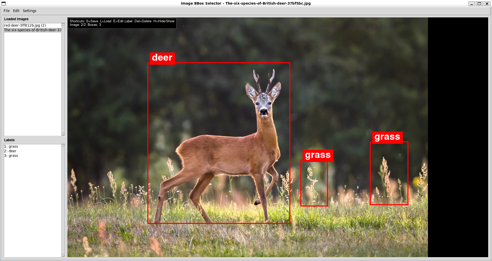

<div align="center">
  <h1>
    
    <span style="vertical-align: middle;">bbox</span>
  </h1>
</div>

<p align="center">
  Simple Python tool for drawing <strong>labeled bounding boxes</strong> on images and saving/loading them as <strong>JSON Lines (<code>.jsonl</code>)</strong> annotation files.
</p>

## Features

- Open **one image, multiple images, or all images in a folder**
- Add a text label to each box
- Switch between loaded images using the **scrollable image list** in the sidebar
- Save annotations for **all loaded images** to a single `.jsonl` file
- Export the **currently displayed image** with bounding boxes and labels drawn onto it
- Reopen a `.jsonl` file and display its saved boxes and labels
- Store **one record per image**, with all boxes and tags for that image on a single line
- Use keyboard shortcuts or the menu bar for common actions

## Requirements

- Python 3
- `Pillow`
- `tkinter` (usually included with Python)
- **Optional** for S3 paths: `s3fs` and `fsspec`

## Install

```bash
pip install pillow
```

For S3 support:

```bash
pip install s3fs fsspec
```

You may need to install python with tk support:
```bash
sudo apt-get install python3-tk
```

## Run

```bash
python image_bbox_selector.py
```

## Basic usage

1. Launch the app.
2. Open one or more image files, a folder of images, or an existing annotation `.jsonl` file.
3. If multiple images are loaded, choose the first one to display when prompted.
4. Click and drag on the image to create a bounding box.
5. Enter a label when prompted.
6. Use the image list in the left sidebar to switch between loaded images.
7. Save the annotations to a `.jsonl` file.

## Shortcuts

- `S` — save JSONL
- `L` — load JSONL
- `C` — clear all boxes
- `Ctrl+Z` or `U` — undo last box
- `H` — hide/show legend

## Examples

<div align="center">
  <p><strong>Program interface</strong></p>
  
</div>

<br />

<div align="center">
  <p><strong>Example exported annotated image</strong></p>
  
</div>

## Multi-image workflow

- `File -> Open Image(s)...` lets you select multiple image files at once
- `File -> Open Folder...` loads all supported images from a folder
- `File -> Open Path/URL...` accepts local paths or S3 URLs for images, folders/prefixes, and `.jsonl` files
- `File -> Open JSONL...` loads all image records from an annotation file
- The left sidebar shows all loaded image names and their current box counts
- Saving writes **all currently loaded image annotations** into the chosen `.jsonl` file
- `File -> Save JSONL to Path/URL...` lets you save annotations directly to a local path or `s3://bucket/...` destination
- `File -> Export Annotated Image...` saves the currently displayed image at its original size with the current boxes and labels overlaid

## S3 workflow

You can now open and save annotations using S3 URLs in addition to local files.
The same is true for loading images or folders (S3 prefix).

Examples:

```text
s3://my-bucket/images/deer.jpg
s3://my-bucket/images/
s3://my-bucket/annotations/deer_boxes.jsonl
```

Notes:

- S3 usage is entirely **optional** and all file I/O can be done locally
- S3 loading/saving uses `s3fs`/`fsspec`
- AWS credentials must already be available in your environment
- If you cancel the startup file picker, the app will prompt for a local path or S3 URL

## JSON Lines format

Annotations are stored in **JSON Lines** format. Each line is one JSON object for a single image, including all bounding boxes and labels for that image.

Example `.jsonl` record:

```json
{"image":"example.jpg","image_size":{"width":1920,"height":1080},"boxes":[{"x1":100,"y1":120,"x2":400,"y2":500,"label":"deer"}]}
```

### Notes

- **One line = one image annotation record**
- A single record contains **all** boxes for that image
- A single `.jsonl` file can contain annotations for **multiple images**
- Annotation files are expected to use the `.jsonl` format
